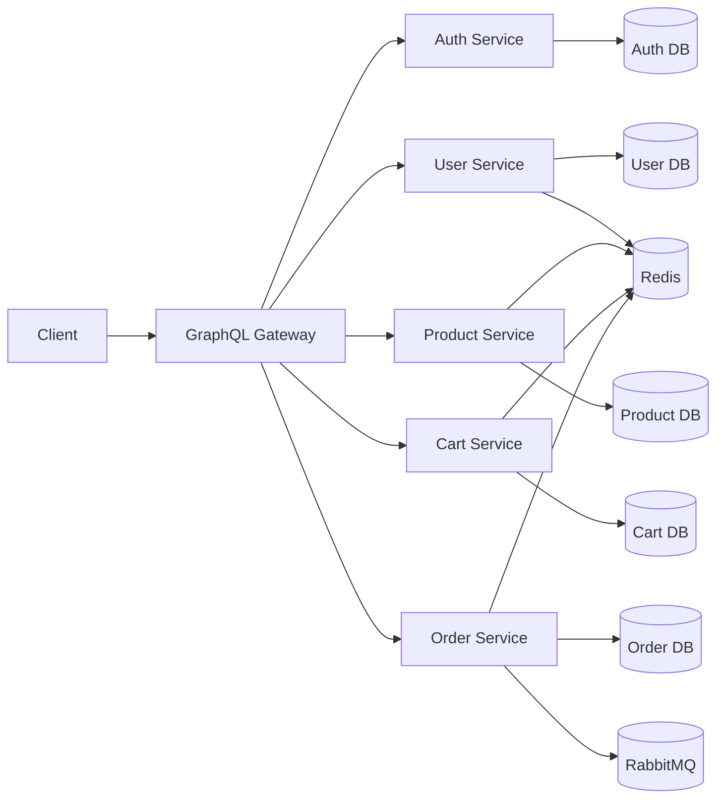

# Contributor Flow

This is the short version of the architecture guide. Use it when you want to get productive quickly without reading the full deep dive.

For the full walkthrough, see `dataflow.md`.

## 1. What This Project Is

This repo is an e-commerce backend with:

- one GraphQL gateway for clients
- five REST microservices behind it
- one PostgreSQL database per service
- Redis for caching
- RabbitMQ for async order-created events

## 2. The Big Picture



## 3. How Requests Usually Flow

Most features follow this path:

```text
GraphQL request
  -> gateway request metadata created
  -> gateway resolver
  -> REST service route
  -> controller
  -> service
  -> repository
  -> Prisma
  -> PostgreSQL
```

Quick meaning of each layer:

- `resolver`: GraphQL entry point and cross-service orchestration
- `route`: HTTP endpoint registration
- `controller`: validates/parses requests and returns responses
- `service`: business logic, caching, side effects
- `repository`: database queries only

Observability note:

- The gateway generates or accepts `x-request-id`.
- The gateway propagates `x-request-id`, `x-operation-name`, `x-user-id`, and `x-user-role` to downstream services when available.
- Each service uses the propagated request id in its own logs, which makes one GraphQL request searchable across gateway and services.

## 4. What Each Service Owns

- `gateway`: public GraphQL API, auth context, DataLoader batching, cross-service orchestration
- `auth-service`: credentials, password hashing, JWTs, refresh tokens
- `user-service`: profile data like name, phone, address
- `product-service`: catalog data, price, inventory, active status
- `cart-service`: current cart and cart items before checkout
- `order-service`: orders, order history, order-created event publishing

## 5. Most Important Flows

### Registration

```text
register mutation
  -> gateway
  -> auth-service creates AuthUser + tokens
  -> user-service creates UserProfile
  -> gateway returns auth payload
```

### Login

```text
login mutation
  -> gateway
  -> auth-service verifies password
  -> auth-service returns new tokens
```

### Product listing

```text
products query
  -> gateway
  -> product-service
  -> Redis or product DB
```

### Cart

```text
cart / addCartItem
  -> gateway checks auth
  -> cart-service
  -> Redis or cart DB
```

### Checkout

```text
checkout mutation
  -> gateway loads cart
  -> gateway loads product prices
  -> order-service creates order
  -> order-service publishes order.created
  -> gateway clears cart
```

This is the most important flow to understand because it touches multiple services.

## 6. Files To Read First

If you only have 15 minutes, read these in order:

1. `README.md`
2. `gateway/src/graphql/schemas/typeDefs.ts`
3. `gateway/src/graphql/resolvers/index.ts`
4. `gateway/src/middleware/auth.ts`
5. `services/order-service/src/services/order.service.ts`
6. `services/order-service/src/queues/rabbitmq.ts`

If you are changing one specific service, then read:

1. `src/app.ts`
2. `src/routes/*.routes.ts`
3. `src/controllers/*.controller.ts`
4. `src/services/*.service.ts`
5. `src/repositories/*.repository.ts`
6. `prisma/schema.prisma`

## 7. Caching Notes

Redis is used as a cache-aside layer:

- `user-service`: `user:<authUserId>`
- `product-service`: `products:list`, `product:<id>`
- `cart-service`: `cart:<userId>`
- `order-service`: `orders:<userId>`

When a write happens, the service usually deletes the affected cache key and reloads fresh data later.

## 8. Performance Notes

- The gateway uses DataLoader for batched `user` and `product` lookups.
- This prevents N+1 calls when GraphQL returns nested orders, cart items, or related entities.
- If you add a nested GraphQL field that triggers repeated lookups, consider adding a loader.
- The gateway also logs total request duration and each downstream service-call duration.

## 9. Debugging Slow Requests

Use this order when a GraphQL request feels slow:

1. Find the gateway log entry for the request.
2. Copy the `requestId`.
3. Search the same `requestId` in service logs.
4. Compare gateway `durationMs` with downstream service `durationMs`.
5. Follow the slowest service into its controller, service, repository, Redis usage, and database path.

Most useful log fields:

- `requestId`
- `operationName`
- `userId`
- `service`
- `durationMs`

## 10. Safe Places To Change Code

Most normal feature work happens in:

- `gateway/src/graphql/resolvers`
- `services/*/src/controllers`
- `services/*/src/services`
- `services/*/src/repositories`
- `services/*/prisma/schema.prisma`

Avoid editing generated Prisma client files in `src/generated/prisma`.

## 11. Rule Of Thumb

- Change the owning service if you are changing stored data or business rules.
- Change the gateway if you are changing how the client consumes combined data.
- Update both if the feature crosses service boundaries.
