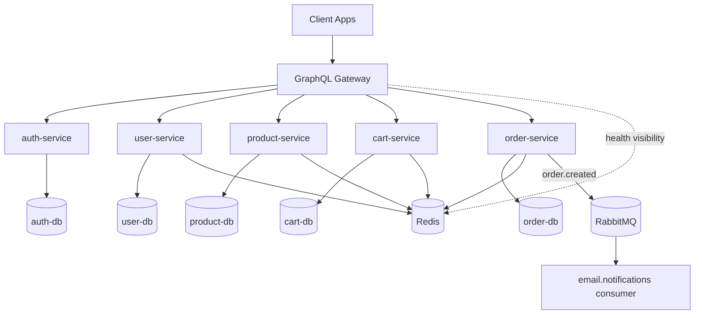

# Data Flow Guide

This document explains how the application works from request entry to persistence, and what each major file/class-like module is responsible for. The goal is to help a new contributor understand the system quickly without having to reverse-engineer every service.

## 1. System Overview

This repository is an e-commerce backend built as a set of REST microservices behind a single GraphQL gateway.

High-level path:

```text
Client
  -> GraphQL Gateway (`gateway`)
  -> REST microservices
      -> Auth Service
      -> User Service
      -> Product Service
      -> Cart Service
      -> Order Service
  -> PostgreSQL databases (one per service)
  -> Redis (caching)
  -> RabbitMQ (async order notification event)
```

Mermaid architecture diagram:



Core idea:

- Clients only talk to the GraphQL gateway.
- The gateway translates GraphQL queries and mutations into REST calls to the services.
- Each service owns its own database schema and business logic.
- Redis is used as a cache in read-heavy services.
- `order-service` publishes an `order.created` event to RabbitMQ after an order is stored.
- The gateway also creates or accepts a correlation id and propagates request metadata to downstream services.

## 2. Runtime Architecture

### Gateway responsibilities

The gateway is the BFF (Backend for Frontend):

- exposes `/graphql`
- validates environment variables
- extracts JWT auth context from the request
- generates or accepts `x-request-id`
- attaches request metadata to the logger and GraphQL context
- applies a simple in-memory rate limit
- resolves GraphQL operations by calling internal REST services
- batches repeated `user` and `product` lookups through DataLoader
- logs total gateway duration and per-service downstream call duration

### Service responsibilities

Each microservice follows the same layering pattern:

```text
server.ts
  -> app.ts
    -> routes/*.routes.ts
      -> controllers/*.controller.ts
        -> services/*.service.ts
          -> repositories/*.repository.ts
            -> Prisma client
              -> PostgreSQL
```

This consistency makes the codebase easier to navigate:

- `server.ts`: bootstraps the process
- `app.ts`: creates Fastify app, registers routes, centralizes error handling
- `routes`: binds URL paths to controller handlers
- `controller`: parses request input and shapes HTTP responses
- `service`: contains business rules, caching, orchestration, side effects
- `repository`: contains database access only
- `utils/prisma.ts`: creates Prisma client
- `utils/redis.ts`: creates Redis client where caching is used

## 3. End-to-End Request Flow

### 3.1 Registration flow

GraphQL mutation:

```graphql
mutation Register {
  register(input: { email: "...", password: "...", name: "..." }) {
    accessToken
    refreshToken
    userId
    email
  }
}
```

Execution path:

1. Client sends `register` mutation to the gateway.
2. Gateway resolver calls `POST /auth/register` on `auth-service`.
3. `auth-service` validates input using Zod.
4. `auth.service.ts` checks if the email already exists.
5. Password is hashed with `bcryptjs`.
6. `auth.repository.ts` creates the `AuthUser` row in the auth database.
7. JWT access and refresh tokens are generated.
8. Refresh token is stored in the `RefreshToken` table.
9. Gateway then calls `POST /users` on `user-service`.
10. `user-service` creates a profile record linked by `authUserId`.
11. User profile is cached in Redis.
12. Gateway returns the auth payload to the client.

Important design detail:

- Identity data and profile data are intentionally split.
- `auth-service` owns login credentials and token lifecycle.
- `user-service` owns the editable user profile.

### 3.2 Login flow

1. Client sends `login` mutation to the gateway.
2. Gateway calls `POST /auth/login`.
3. `auth-service` finds the user by email.
4. Password hash is verified with `bcrypt.compare`.
5. New access and refresh tokens are issued.
6. Refresh token is stored in the database.
7. Tokens are returned to the client.

### 3.3 Token refresh flow

1. Client sends `refreshToken` mutation to the gateway.
2. Gateway calls `POST /auth/refresh`.
3. `auth-service` verifies the refresh token signature.
4. Stored refresh token row is looked up in the database.
5. Old refresh token row is deleted.
6. A new token pair is created and the new refresh token is stored.
7. Gateway returns the refreshed auth payload.

### 3.4 Authenticated request flow

For authenticated GraphQL operations such as `me`, `cart`, `orders`, `addCartItem`, and `checkout`:

1. Client sends `Authorization: Bearer <token>` to the gateway.
2. Gateway middleware reads and verifies the JWT locally using `JWT_SECRET`.
3. Gateway generates or reuses `x-request-id`.
4. Gateway stores `{ userId, email, role, token }` in GraphQL context.
5. Gateway stores request metadata such as `requestId`, `operationName`, `userId`, and `userRole`.
6. Resolvers call `requireAuth(...)` for protected operations.
7. Resolver uses `context.auth.userId` to call downstream services.
8. Gateway propagates these headers to internal services:
   - `x-request-id`
   - `x-operation-name`
   - `x-user-id`
   - `x-user-role`
9. Each service logs using the same request id for cross-service tracing.

Important implementation detail:

- The gateway does not call `auth-service` on every request.
- It validates the JWT itself inside `gateway/src/middleware/auth.ts`.
- The propagated user metadata is for correlation and debugging. Authorization still happens in gateway code.

### 3.5 Product browsing flow

1. Client runs `products` or `product(id)` through GraphQL.
2. Gateway resolver calls `product-service`.
3. `product-service` first checks Redis.
4. On cache miss, repository reads from PostgreSQL.
5. Price values are normalized from Prisma Decimal to JavaScript numbers in the controller.
6. Response is returned to the gateway.
7. Gateway returns GraphQL data to the client.

Caching behavior:

- `products:list` caches the active product list.
- `product:<id>` caches single product lookups.
- Product create/update invalidates the relevant cache keys.

### 3.6 User profile lookup flow

This happens in two main places:

- `me` query
- nested `Order.user` GraphQL field

Execution path:

1. Gateway resolver asks `userLoader` for one or more user IDs.
2. DataLoader batches repeated lookups within the same GraphQL request.
3. Gateway calls `POST /users/bulk` once with all IDs.
4. `user-service` loads those profiles from PostgreSQL.
5. Results are written into Redis for subsequent direct reads.
6. Gateway maps the results back to the requested order.

Why this matters:

- It avoids N+1 calls when multiple orders reference users.
- It centralizes profile ownership inside `user-service`.

### 3.7 Cart flow

GraphQL operations involved:

- `cart`
- `addCartItem`

Execution path for reading a cart:

1. Gateway checks authentication.
2. Gateway calls `GET /cart/:userId`.
3. `cart-service` checks Redis for `cart:<userId>`.
4. On cache miss, repository runs `upsertCart(userId)`.
5. If cart does not exist, it is created automatically.
6. Cart plus items are returned and cached.

Execution path for adding an item:

1. Gateway calls `POST /cart/:userId/items`.
2. Controller validates `{ productId, quantity }`.
3. Service ensures a cart exists using `upsertCart`.
4. Repository checks whether the same product already exists in that cart.
5. If it exists, quantity is incremented.
6. Otherwise a new `CartItem` row is inserted.
7. Redis cart cache is cleared.
8. Updated cart is reloaded and returned.

Important design detail:

- `cart-service` stores only `productId` and quantity, not full product details.
- Product details are resolved later in GraphQL through `CartItem.product` using the product DataLoader.

### 3.8 Checkout flow

This is the most important cross-service flow.

GraphQL mutation:

```graphql
mutation Checkout {
  checkout(input: { shippingAddress: "..." }) {
    id
    status
    totalAmount
  }
}
```

Execution path:

1. Client sends `checkout` mutation to the gateway.
2. Gateway validates that the user is authenticated.
3. Gateway loads the current cart from `cart-service`.
4. Gateway loads each referenced product through `productLoader`.
5. Gateway constructs order items using:
   - `productId`
   - `quantity`
   - `unitPrice` from the current product price
6. Gateway calls `POST /orders` on `order-service`.
7. `order-service` validates the payload.
8. `order.service.ts` calculates `totalAmount` from the submitted items.
9. Repository creates the `Order` and nested `OrderItem[]` rows in PostgreSQL.
10. `order-service` clears the cached user-order list in Redis.
11. `order-service` publishes an `order.created` event to RabbitMQ.
12. Gateway calls `DELETE /cart/:userId/clear` on `cart-service`.
13. Cart items are deleted and the empty cart is returned.
14. Gateway returns the created order to the client.
15. The full cross-service flow can be traced in logs by the shared `requestId`.

Important design detail:

- Price locking happens at checkout time because `unitPrice` is copied into the order payload before persistence.
- The order keeps historical prices even if product prices change later.

### 3.9 Order history flow

1. Client queries `orders` through GraphQL.
2. Gateway checks auth and calls `GET /orders/user/:userId`.
3. `order-service` checks Redis key `orders:<userId>`.
4. On cache miss, it reads orders and nested items from PostgreSQL.
5. Decimal fields are normalized into numbers.
6. Gateway resolves nested `user` and `product` fields through DataLoader.
7. Final GraphQL response is returned.

### 3.10 Asynchronous notification flow

After an order is created:

1. `order-service` publishes a message with routing key `order.created`.
2. RabbitMQ exchange `commerce.events` routes it to queue `email.notifications`.
3. On service startup, `startNotificationConsumer()` creates a consumer.
4. The consumer logs a simulated email notification.
5. Message is acknowledged after processing.

Important note:

- There is no separate notification service yet.
- The consumer currently lives inside `order-service` and simulates background email delivery via logging.

## 4. Gateway File Responsibilities

### `gateway/src/index.ts`

Main gateway bootstrap.

Responsibilities:

- creates Express app
- connects to Redis for health visibility
- adds CORS and JSON middleware
- attaches `pino-http` logging
- generates or accepts `x-request-id`
- captures request metadata like operation name and authenticated user info
- applies an in-memory per-IP rate limiter
- starts Apollo Server
- attaches GraphQL context with auth info and DataLoaders
- exposes `/health` and `/graphql`

### `gateway/src/graphql/schemas/typeDefs.ts`

Defines the GraphQL contract exposed to clients.

Contains:

- GraphQL object types such as `User`, `Product`, `Cart`, `Order`
- input types such as `RegisterInput`, `AddCartItemInput`, `CheckoutInput`
- root queries and mutations

This file is the public API surface of the backend.

### `gateway/src/graphql/resolvers/index.ts`

Central orchestration layer between GraphQL and the REST services.

Responsibilities:

- converts GraphQL operations into REST calls
- enforces authentication for protected operations
- coordinates multi-service workflows like register and checkout
- resolves nested fields like `CartItem.product` and `Order.user`
- forwards request metadata through the GraphQL context to downstream calls

This file contains the most important cross-service business flow in the entire repo.

### `gateway/src/graphql/loaders/index.ts`

Creates DataLoaders for batched lookups.

Responsibilities:

- batches `user-service` lookups using `/users/bulk`
- batches `product-service` lookups using `/products/bulk`
- preserves request-local caching during one GraphQL request
- reuses the same request metadata for batched downstream calls

Use case:

- avoids repetitive REST calls when a GraphQL response contains many repeated users or products

### `gateway/src/middleware/auth.ts`

JWT extraction and authentication helpers.

Responsibilities:

- reads the `Authorization` header
- verifies JWT access tokens
- extracts `sub`, `email`, `role`
- builds the auth object used by resolvers
- throws for protected operations when the user is missing

### `gateway/src/utils/http.ts`

Small shared fetch wrapper.

Responsibilities:

- sends JSON requests to internal services
- sets `content-type: application/json`
- propagates `x-request-id`, `x-operation-name`, `x-user-id`, and `x-user-role`
- logs downstream latency with service name, method, path, status, and `durationMs`
- throws helpful errors for non-2xx responses
- returns parsed JSON bodies

### `gateway/src/config/env.ts`

Runtime configuration parser.

Responsibilities:

- loads `.env`
- validates service URLs, Redis URL, JWT secret, and port using Zod

### `gateway/src/config/logger.ts`

Creates the shared Pino logger used by the gateway.

## 5. Auth Service Responsibilities

Purpose:

- owns authentication, password hashing, JWT issuance, and refresh-token persistence

Primary data models:

- `AuthUser`
- `RefreshToken`

Key files:

### `services/auth-service/src/server.ts`

Starts the Fastify server.

### `services/auth-service/src/app.ts`

Builds the app, registers `/auth/*` routes, handles validation/unhandled errors, and logs propagated request metadata from gateway headers.

### `services/auth-service/src/routes/auth.routes.ts`

Maps HTTP endpoints to controller methods:

- `POST /auth/register`
- `POST /auth/login`
- `POST /auth/refresh`
- `GET /auth/validate`

### `services/auth-service/src/controllers/auth.controller.ts`

HTTP-facing layer.

Responsibilities:

- parses body payloads with Zod
- extracts bearer token for validation endpoint
- translates service results into HTTP responses

### `services/auth-service/src/services/auth.service.ts`

Core auth business logic.

Responsibilities:

- checks whether user already exists
- hashes passwords with bcrypt
- issues access and refresh tokens
- stores refresh tokens
- rotates refresh tokens during refresh flow
- validates access tokens and resolves current auth user

### `services/auth-service/src/repositories/auth.repository.ts`

Database access layer for auth data.

Responsibilities:

- create auth user
- find by email or ID
- create/find/delete refresh token records

### `services/auth-service/src/validation/auth.validation.ts`

Zod schemas for register, login, and refresh requests.

### `services/auth-service/prisma/schema.prisma`

Defines the auth database schema.

Use case of each model:

- `AuthUser`: login identity, hashed password, and role
- `RefreshToken`: persistent refresh-token session records

### `services/auth-service/src/utils/prisma.ts`

Creates the Prisma client using the PostgreSQL adapter.

### `services/auth-service/src/utils/redis.ts`

Creates a Redis client. In the current implementation it exists for consistency, but auth logic does not actively use Redis yet.

## 6. User Service Responsibilities

Purpose:

- owns user profile data that is separate from authentication credentials

Primary data model:

- `UserProfile`

Key files:

### `services/user-service/src/server.ts`

Starts the service process.

### `services/user-service/src/app.ts`

Registers routes, converts known business errors such as `User not found` into HTTP 404, and logs propagated request metadata.

### `services/user-service/src/routes/user.routes.ts`

Routes:

- `POST /users`
- `POST /users/bulk`
- `GET /users/:authUserId`
- `PUT /users/:authUserId`

### `services/user-service/src/controllers/user.controller.ts`

Responsibilities:

- validates create/update payloads
- validates bulk lookup body
- forwards requests to the service layer

### `services/user-service/src/services/user.service.ts`

Core profile logic.

Responsibilities:

- creates user profiles after auth registration
- updates profile data
- reads single profiles with Redis cache-aside logic
- performs bulk lookup for DataLoader-based GraphQL resolution
- warms Redis during bulk reads

### `services/user-service/src/repositories/user.repository.ts`

Database access for `UserProfile` rows.

### `services/user-service/src/validation/user.validation.ts`

Zod schemas for create/update profile operations.

### `services/user-service/prisma/schema.prisma`

Defines the profile database schema.

Use case of the model:

- `UserProfile`: application-facing user details keyed by `authUserId`

### `services/user-service/src/utils/redis.ts`

Stores cached user profiles under keys like `user:<authUserId>`.

## 7. Product Service Responsibilities

Purpose:

- owns the product catalog and exposes both individual and bulk product lookup

Primary data model:

- `Product`

Key files:

### `services/product-service/src/server.ts`

Starts the service process.

### `services/product-service/src/app.ts`

Registers routes, handles `Product not found` as a 404, and logs propagated request metadata.

### `services/product-service/src/routes/product.routes.ts`

Routes:

- `GET /products`
- `POST /products/bulk`
- `GET /products/:id`
- `POST /products`
- `PUT /products/:id`

### `services/product-service/src/controllers/product.controller.ts`

Responsibilities:

- validates request bodies
- normalizes Prisma Decimal values into JSON-safe numbers
- shapes list/single/bulk responses

### `services/product-service/src/services/product.service.ts`

Core catalog logic.

Responsibilities:

- caches product list and individual product reads
- invalidates cache on create/update
- exposes bulk product lookup for gateway DataLoader usage

### `services/product-service/src/repositories/product.repository.ts`

Database access for catalog reads and writes.

### `services/product-service/src/validation/product.validation.ts`

Zod schemas for product creation, update, and bulk lookup.

### `services/product-service/prisma/schema.prisma`

Defines the catalog schema.

Use case of the model:

- `Product`: source of truth for product content, price, inventory, and activation status

### `services/product-service/src/utils/redis.ts`

Caches:

- `products:list`
- `product:<id>`

## 8. Cart Service Responsibilities

Purpose:

- owns the user cart and item quantities before checkout

Primary data models:

- `Cart`
- `CartItem`

Key files:

### `services/cart-service/src/server.ts`

Starts the service process.

### `services/cart-service/src/app.ts`

Registers routes, handles shared validation errors, and logs propagated request metadata.

### `services/cart-service/src/routes/cart.routes.ts`

Routes:

- `GET /cart/:userId`
- `POST /cart/:userId/items`
- `PUT /cart/:userId/items/:itemId`
- `DELETE /cart/:userId/items/:itemId`
- `DELETE /cart/:userId/clear`

### `services/cart-service/src/controllers/cart.controller.ts`

Responsibilities:

- validates add/update item payloads
- forwards cart operations to the service layer

### `services/cart-service/src/services/cart.service.ts`

Core cart logic.

Responsibilities:

- creates carts lazily with `upsertCart`
- caches entire carts per user
- merges repeated additions of the same product
- invalidates cache after cart changes
- clears cart after checkout

### `services/cart-service/src/repositories/cart.repository.ts`

Database access for cart state.

Use cases:

- `upsertCart`: guarantees a cart exists for each user
- `upsertItem`: either increments quantity or inserts a new cart item
- `clearCart`: removes all items but keeps the cart record itself

### `services/cart-service/src/validation/cart.validation.ts`

Zod schemas for add/update item requests.

### `services/cart-service/prisma/schema.prisma`

Defines the cart schema.

Use case of each model:

- `Cart`: root cart owned by a single user
- `CartItem`: product reference plus quantity inside the cart

### `services/cart-service/src/utils/redis.ts`

Caches user carts under `cart:<userId>`.

## 9. Order Service Responsibilities

Purpose:

- owns order creation, order history, and asynchronous order-created events

Primary data models:

- `Order`
- `OrderItem`

Key files:

### `services/order-service/src/server.ts`

Starts the HTTP server and also starts the RabbitMQ notification consumer.

### `services/order-service/src/app.ts`

Registers routes, handles validation/not-found errors, and logs propagated request metadata.

### `services/order-service/src/routes/order.routes.ts`

Routes:

- `POST /orders`
- `GET /orders/:id`
- `GET /orders/user/:userId`

### `services/order-service/src/controllers/order.controller.ts`

Validates create-order payloads and returns service results.

### `services/order-service/src/services/order.service.ts`

Core order logic.

Responsibilities:

- calculates order totals
- persists orders and nested items
- normalizes Decimal values into numbers
- caches order history per user
- invalidates cache after new order creation
- publishes `order.created` event after persistence

### `services/order-service/src/repositories/order.repository.ts`

Database access for orders and order items.

### `services/order-service/src/validation/order.validation.ts`

Zod schema for checkout payloads reaching the order service.

### `services/order-service/src/queues/rabbitmq.ts`

Messaging integration layer.

Responsibilities:

- lazily creates and reuses the RabbitMQ channel
- declares exchange `commerce.events`
- declares queue `email.notifications`
- binds routing key `order.created`
- publishes order-created events
- starts a retrying consumer loop on boot
- logs simulated email notification handling

### `services/order-service/prisma/schema.prisma`

Defines the order database schema.

Use case of each model:

- `Order`: checkout snapshot containing status, address, and total amount
- `OrderItem`: per-product snapshot storing quantity and locked-in price

### `services/order-service/src/utils/redis.ts`

Caches user order history under `orders:<userId>`.

## 10. Observability And Correlation

Request correlation works like this:

```text
Client
  -> GraphQL Gateway
      -> requestId created or reused
      -> operationName extracted
      -> auth resolved
      -> downstream headers propagated
  -> REST Services
      -> Fastify uses x-request-id as request id
      -> logs include requestId, operationName, userId, userRole
```

Key fields:

- `requestId`: primary correlation id across gateway and services
- `operationName`: GraphQL operation name when the client sends one
- `userId`: authenticated user id when available
- `userRole`: authenticated role when available
- `durationMs`: elapsed time for gateway requests and downstream service calls

How to debug a slow request:

1. Find `Gateway request completed` in gateway logs.
2. Note `requestId` and total `durationMs`.
3. Search `Downstream service request completed` with the same `requestId`.
4. Compare the downstream durations.
5. Inspect the slowest service with the same `requestId`.

This gives you log-based distributed tracing even without OpenTelemetry.

## 11. Data Ownership by Service

This is important for contributors so boundaries stay clear.

- `auth-service` owns credentials, roles, access tokens, refresh tokens
- `user-service` owns user profile details
- `product-service` owns the product catalog and inventory count field
- `cart-service` owns temporary pre-checkout cart state
- `order-service` owns immutable purchase records and order events
- `gateway` owns client-facing GraphQL composition and cross-service orchestration

A good rule when making changes:

- If the change is about how data is stored, start in the owning service.
- If the change is about how clients consume combined data, start in the gateway.

## 12. Shared Infrastructure Files

### `docker-compose.yml`

Local orchestration for:

- gateway
- all services
- one PostgreSQL instance per service
- Redis
- RabbitMQ

This file describes the full local runtime topology.

### Root `package.json`

Defines npm workspaces and shared scripts for build, lint, test, Prisma generate, and migration commands.

### `GRAPHQL_TESTING.md`

Manual testing reference for GraphQL operations.

### `infra/aws/*`

Deployment scaffolding for API Gateway and ECS-style production hosting.

### `infra/docker/README.md` and `infra/k8s/README.md`

Infrastructure notes for containerized deployment approaches.

## 13. Redis and Cache Strategy

Current cache usage:

- `user-service`: single user profiles and bulk-read warmup
- `product-service`: product list and single product reads
- `cart-service`: entire cart by user
- `order-service`: order history by user
- `gateway`: Redis is connected mainly for health visibility, not request caching

Pattern used:

- read from Redis first
- on miss, read from DB
- store fresh value with TTL
- invalidate affected keys after writes

## 14. Important Contributor Notes

### The gateway is the orchestrator

The heaviest cross-service logic lives in the GraphQL gateway, especially:

- `register`
- `checkout`
- nested entity resolution

If a feature spans multiple services, the gateway usually needs changes too.

### Services are intentionally decoupled

There are no direct database joins across services.

Instead:

- services store IDs from other domains
- gateway resolves related objects later
- order records snapshot price data to avoid depending on future product changes

### DataLoader matters for GraphQL performance

If a new GraphQL field needs repeated entity lookups, add a loader or reuse an existing one. That keeps the API from making one REST call per nested row.

### Observability now follows the request across services

When you add a new gateway-to-service call, make sure it goes through the shared HTTP helper so request headers and timing logs continue to propagate automatically.

### Generated Prisma files are not the place for app logic

The `src/generated/prisma` folders are generated code. Most contributor changes should happen in:

- `routes`
- `controllers`
- `services`
- `repositories`
- `prisma/schema.prisma`

## 15. Best Starting Points for New Contributors

If you want to understand the full system quickly, read in this order:

1. `README.md`
2. `gateway/src/graphql/schemas/typeDefs.ts`
3. `gateway/src/graphql/resolvers/index.ts`
4. one service at a time in this order:
   - `app.ts`
   - `routes`
   - `controller`
   - `service`
   - `repository`
   - `prisma/schema.prisma`
5. `services/order-service/src/queues/rabbitmq.ts`
6. `docker-compose.yml`

## 16. Short Summary

In one sentence:

- the GraphQL gateway composes multiple REST microservices, each service owns its own data and persistence, Redis accelerates reads, and order creation additionally emits an asynchronous RabbitMQ event.

In one longer sentence:

- a request enters through GraphQL, the gateway authenticates and orchestrates downstream REST calls, services validate input and apply business logic, repositories persist data through Prisma into service-specific PostgreSQL databases, Redis caches hot reads, and `order-service` publishes post-checkout events for asynchronous processing.
